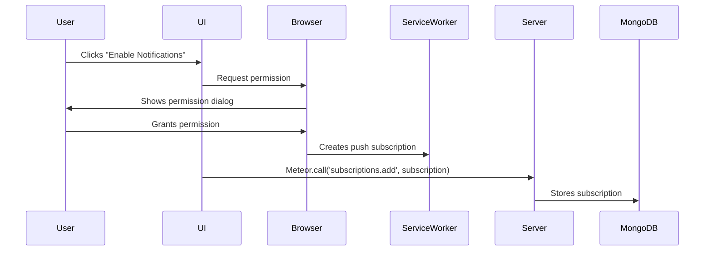
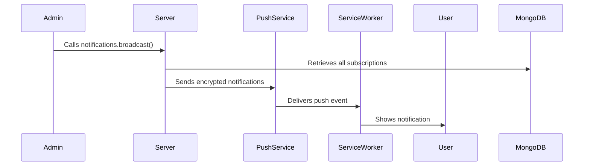

# Meteor PWA Architecture Deep Dive

This document provides a comprehensive breakdown of the architecture for the Meteor Progressive Web App (PWA) with push notifications implementation.

## Core Architectural Components

### 1. Service Worker (`sw.js`)
**Location**: `/public/sw.js`  
**Role**: The offline and push notification backbone of the PWA

#### Key Functionality:
- **Lifecycle Management**:
  - `install` event: Caches critical assets for offline use
  - `activate` event: Cleans up old caches
  - `fetch` event: Serves cached responses when offline

- **Push Notification Handling**:
  - `push` event: Receives and displays push notifications
  - `notificationclick` event: Handles user interaction with notifications
  - `notificationclose` event: (Optional) Handles when user dismisses notification

- **Advanced Features**:
  - Background sync (optional implementation)
  - Periodic sync (optional implementation)

### 2. Web App Manifest (`manifest.json`)
**Location**: `/public/manifest.json`  
**Role**: Defines the PWA's install behavior and appearance

#### Key Properties:
```json
{
  "name": "Meteor PWA",
  "short_name": "MPWA",
  "start_url": "/",
  "display": "standalone",
  "background_color": "#ffffff",
  "theme_color": "#0277bd",
  "icons": [...]
}
```

### 3. Client-Side Components

#### NotificationManager (`NotificationManager.tsx`)
**Responsibilities**:
- Manages push notification subscription lifecycle
- Handles browser permission requests
- Provides UI controls for notification management
- Interfaces with Meteor methods for server communication

#### PWAInstaller (`PWAInstaller.tsx`)
**Responsibilities**:
- Detects PWA install capability
- Manages the "Add to Home Screen" prompt
- Tracks installation state

### 4. Server-Side Architecture

#### Notification Service (`notifications.ts`)
**Location**: `/imports/api/notifications.ts`

**Core Methods**:
1. `subscriptions.add` - Stores push subscription in MongoDB
2. `subscriptions.remove` - Removes user's push subscription
3. `notifications.send` - Sends notification to specific user
4. `notifications.broadcast` - Sends notification to all subscribed users

**Data Model**:
```typescript
interface PushSubscription {
  _id: string;
  userId: string;
  endpoint: string;
  keys: {
    p256dh: string;
    auth: string;
  };
  createdAt: Date;
}
```

#### Web Push Configuration
- Uses VAPID (Voluntary Application Server Identification) for secure push
- Keys stored in Meteor settings (`settings.json`)

### 5. Configuration (`settings.json`)
**Security Note**: Never commit to version control

**Essential Configuration**:
```json
{
  "public": {
    "vapidPublicKey": "your-public-key"
  },
  "private": {
    "vapidPrivateKey": "your-private-key",
    "vapidEmail": "mailto:your@email.com"
  }
}
```

## Architectural Flow

### 1. Initialization Sequence
1. Browser loads PWA
2. Service worker registers
3. Manifest is processed
4. Client checks notification permissions
5. UI renders based on PWA capabilities

### 2. Notification Subscription Flow


### 3. Notification Delivery Flow


## Key Architectural Decisions

1. **Service Worker Strategy**: Network-first with cache fallback for optimal balance
2. **Data Synchronization**: Uses Meteor's DDP protocol for real-time updates
3. **Security**: VAPID authentication for all push notifications
4. **Storage**: MongoDB for subscription persistence
5. **Modularity**: Separates notification logic from core application logic

This architecture provides a robust foundation for Meteor PWAs with push notification capabilities while maintaining security, performance, and scalability.