<h1 align="center">Meteor Push PWA 🚀</h1>

<p align="center">
  <a href="https://github.com/devshad-01/meteor-push-pwa/stargazers"></a>
  <a href="https://github.com/devshad-01/meteor-push-pwa/network/members"></a>
  <a href="https://github.com/devshad-01/meteor-push-pwa/issues"></a>
  <a href="https://github.com/devshad-01/meteor-push-pwa/blob/main/LICENSE"></a>
</p>

<p align="center">
  <b>🚨 The easiest way to add <u>Web Push Notifications</u> to your Meteor app — with full iOS (Safari) support, no paid service required!</b><br>
  <b>Modern, production-ready PWA template with Meteor, React, push notifications, and real-time features.</b><br>
  <a href="#demo">🌐 Live Demo</a> •
  <a href="#features">Features</a> •
  <a href="#quick-start">Quick Start</a> •
  <a href="#why-star-this-repo">Why Star?</a>
</p>

---

## ⭐ Star this repo!

If you like this project, please [star it on GitHub](https://github.com/devshad-01/meteor-push-pwa) — it helps others discover it and motivates further development!

---

## 📸 Demo

> **Live Demo:** [https://pwameteor.meteorapp.com/dashboard](https://pwameteor.meteorapp.com/dashboard)


---

# 🚀 Meteor PWA with Real-time Notifications & Authentication

A comprehensive Progressive Web App built with Meteor 3.3, featuring real-time notifications, authentication, state management, and user tracking.

## ✨ Features

- 🔐 **Secure Authentication** - Email/password authentication with rate limiting
- 🔔 **Real-time Notifications** - Personalized and broadcast push notifications
- ⚡ **Live Tracking** - Real-time user activity and presence tracking
- 📱 **PWA Support** - Service workers, offline capability, installable app
- 🎯 **State Management** - Zustand for client-side state management
- 🛡️ **Security** - CSRF protection, input validation, secure headers
- 📊 **Real-time Data** - Live updates using Meteor's reactive data layer
- 🚀 **Auto-Install Prompt** - Professional PWA installation experience

## 🚀 Quick Start

### 1. Clone and Install

```bash
git clone <your-repo-url>
cd PWA
npm install
```

### 2. Generate VAPID Keys

For push notifications, you need VAPID keys. Generate them using:

```bash
npx web-push generate-vapid-keys
```

### 3. Configure Settings

Copy the example settings file:

```bash
cp settings-example.json settings.json
```

Update `settings.json` with your VAPID keys:

```json
{
  "vapid": {
    "email": "mailto:your-email@example.com",
    "publicKey": "your-vapid-public-key",
    "privateKey": "your-vapid-private-key"
  },
  "public": {
    "vapidPublicKey": "your-vapid-public-key",
    "appName": "PWA Notification App"
  }
}
```

### 4. Run the Application

```bash
meteor run --settings settings.json
```

The app will be available at `http://localhost:3000`

## 📱 Usage

### Authentication

1. Visit the app and click "Sign Up" to create an account
2. Or "Login" if you already have an account
3. Rate limiting protects against brute force attacks

### Notifications

1. After logging in, enable push notifications in the dashboard
2. Test different notification types:
   - **Personal notifications** - sent to specific users
   - **Broadcast notifications** - sent to all users
   - **Urgent pings** - high-priority notifications with actions

### PWA Installation

The app automatically prompts users to install it as a native app:

1. **Automatic Detection** - App detects when installation is available
2. **Install Button** - Clean "📱 Install App" button appears in dashboard
3. **Professional Flow** - Uses browser's native installation prompt
4. **Install Status** - Shows "✅ App Installed" when completed
5. **Standalone Mode** - Runs like a native app once installed

### Real-time Features

- **Online users** - See who's currently active
- **Live activity** - Track user actions in real-time
- **Presence detection** - Online/away/offline status
- **Instant updates** - All data updates in real-time

## 🏗️ Architecture

### State Management

- **Zustand stores** for client-side state
- **AuthStore** - Authentication state and user management
- **NotificationStore** - Notifications and toast messages
- **TrackingStore** - User activity and presence tracking

### Real-time Data

- **Meteor Publications** - Server-side data publishing
- **Reactive subscriptions** - Client-side data synchronization
- **Live queries** - Automatic UI updates on data changes

### Security Features

- **Rate limiting** on login attempts and API calls
- **Input validation** and sanitization
- **CSRF protection** and secure headers
- **Session management** with configurable expiration

### PWA Features

- **Service Workers** for offline functionality and push notifications
- **Web App Manifest** for native app installation
- **Push API** for background notifications with VAPID authentication
- **Background Sync** for offline actions and data synchronization
- **Install Prompts** for professional app installation experience
- **Standalone Mode** - Runs like a native mobile/desktop app

## 🔧 Service Worker Architecture

### Core Functionality

The service worker (`/public/sw.js`) provides:

#### 1. **Lifecycle Management**

```javascript
// Install: Immediate activation for faster updates
self.addEventListener("install", (event) => {
  self.skipWaiting(); // Force immediate activation
});

// Activate: Clean up old caches and claim clients
self.addEventListener("activate", (event) => {
  self.clients.claim(); // Take control immediately
  // Clean up old cache versions
});
```

#### 2. **Push Notification Handling**

```javascript
// Receive and display push notifications
self.addEventListener("push", (event) => {
  const data = event.data.json();

  // Advanced notification options based on priority
  const options = {
    body: data.body,
    icon: "/icons/icon-192x192.svg",
    badge: "/icons/icon-192x192.svg",
    tag: data.tag,
    requireInteraction: data.priority === "urgent",
    silent: data.priority === "low",
    vibrate:
      data.priority === "urgent" ? [200, 100, 200, 100, 200] : [100, 50, 100],
    actions: data.actions || [],
  };

  self.registration.showNotification(data.title, options);
});
```

#### 3. **Notification Interaction**

```javascript
// Handle notification clicks
self.addEventListener("notificationclick", (event) => {
  event.notification.close();

  // Focus existing window or open new one
  event.waitUntil(
    clients.matchAll({ type: "window" }).then((clients) => {
      // Smart window management
    })
  );
});
```

#### 4. **Background Sync** (Future Enhancement)

```javascript
// Handle offline actions when back online
self.addEventListener("sync", (event) => {
  if (event.tag === "background-sync") {
    // Sync offline notifications/actions
  }
});
```

### Push Notification Flow


### PWA Installation Flow

```mermaid
sequenceDiagram
    participant User
    participant Browser
    participant App
    participant PWAInstaller

    User->>Browser: Uses app multiple times
    Browser->>Browser: Meets PWA criteria
    Browser->>App: Fires 'beforeinstallprompt'
    App->>PWAInstaller: Shows install button
    User->>PWAInstaller: Clicks "📱 Install App"
    PWAInstaller->>Browser: Calls prompt()
    Browser->>User: Shows install dialog
    User->>Browser: Confirms installation
    Browser->>App: Fires 'appinstalled' event
    App->>PWAInstaller: Shows "✅ App Installed"
```



## 📁 Project Structure

```
├── client/           # Client entry point
├── imports/
│   ├── api/         # Server-side API and methods
│   │   ├── collections.ts    # MongoDB collections
│   │   └── notifications.ts  # Notification methods
│   ├── stores/      # Zustand state stores
│   │   ├── authStore.ts         # Authentication state
│   │   ├── notificationStore.ts # Notification & toast state
│   │   └── trackingStore.ts     # User activity tracking
│   └── ui/          # React components
│       ├── UltraCompactDashboard.tsx # Main dashboard
│       ├── MinimalNotificationManager.tsx # Notification controls
│       ├── PWAInstaller.tsx     # Install prompt component
│       ├── Login.tsx            # Authentication UI
│       ├── Profile.tsx          # User profile
│       └── NotificationCenter.tsx # Notification history
├── public/          # Static assets and PWA files
│   ├── manifest.json # PWA manifest
│   ├── sw.js        # Service worker
│   └── icons/       # PWA icons
├── server/          # Server entry point
└── settings.json    # Configuration (create from example)
```

## 🔧 Configuration

### Environment Variables

For production, use environment variables instead of settings.json:

```bash
export VAPID_PUBLIC_KEY="your-public-key"
export VAPID_PRIVATE_KEY="your-private-key"
export VAPID_EMAIL="mailto:your-email@example.com"
```

### Database

Meteor uses MongoDB by default. The app creates the following collections:

- `users` - User accounts and authentication
- `notifications` - Notification history
- `subscriptions` - Push notification subscriptions
- `userActivity` - User activity tracking
- `onlineUsers` - Real-time presence data

## 🛡️ Security Considerations

- Never commit `settings.json` with real keys to version control
- Use environment variables for production deployments
- Regularly rotate VAPID keys
- Configure proper CORS and security headers
- Use HTTPS in production for push notifications

## 🚀 Deployment

### Meteor Galaxy

```bash
meteor deploy your-app.meteorapp.com --settings settings.json
```

### Docker

```bash
meteor build --directory ../build
cd ../build
docker build -t pwa-app .
docker run -p 3000:3000 pwa-app
```

## 📚 API Reference

### Notification Methods

- `notifications.send(userId, notification)` - Send personal notification
- `notifications.sendBroadcast(notification)` - Send to all users (alias for broadcast)
- `notifications.broadcast(notification)` - Send to all users
- `notifications.markAsRead(notificationId)` - Mark as read
- `notifications.remove(notificationId)` - Delete notification

> **Note:** Notification counters and unread counts are always real-time and accurate, powered by Meteor 3 async methods and Zustand state sync. All notification state is kept in sync with the server using a custom hook (`useNotificationsSync`).

### Tracking Methods

- `tracking.updateStatus(status, sessionId)` - Update user status
- `tracking.logActivity(activity)` - Log user action
- `tracking.heartbeat(sessionId)` - Maintain online presence

### Subscription Methods

- `subscriptions.add(subscription, userId)` - Register push subscription
- `subscriptions.remove(userId)` - Remove subscription
- `subscriptions.clearAll()` - Remove all subscriptions (admin)

### PWA Installation Events

- `beforeinstallprompt` - Browser ready to show install prompt
- `appinstalled` - App successfully installed
- `prompt()` - Trigger installation dialog

## 🤝 Contributing

1. Fork the repository
2. Create a feature branch
3. Make your changes
4. Add tests if applicable
5. Submit a pull request

## 📄 License

MIT License - see LICENSE file for details

## 🆘 Support

If you encounter issues:

1. Check the browser console for errors
2. Verify VAPID keys are configured correctly
3. Ensure HTTPS is used in production
4. Check that service workers are registered

For push notification issues:

- Verify browser support for Push API
- Check notification permissions
- Ensure service worker is active
- Validate VAPID key format

For PWA installation issues:

- Ensure app is served over HTTPS (required for installation)
- Check that manifest.json is properly configured
- Verify service worker is registered successfully
- Ensure app meets PWA installability criteria:
  - Has a web app manifest
  - Has a registered service worker
  - Is served over HTTPS
  - Has proper icons (192px and 512px minimum)

---

## 🌟 Why Star This Repo?

- **Stay Updated:** Get notified of new features and improvements
- **Support Open Source:** Your star motivates further development
- **Boost Discoverability:** More stars = more visibility for the project
- **Join the Community:** Be part of a growing Meteor/React/PWA community

---

## 📢 Share & Contribute

- **Share** this repo on Twitter, Reddit, Dev.to, or your favorite dev community!
- **Submit issues** and feature requests — your feedback is welcome
- **Open a PR** for bug fixes, docs, or new features
- **Add a badge to your own project** if you use this template!
